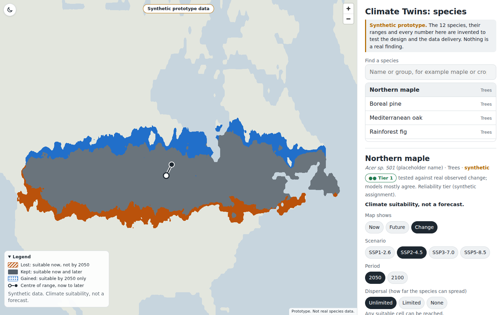
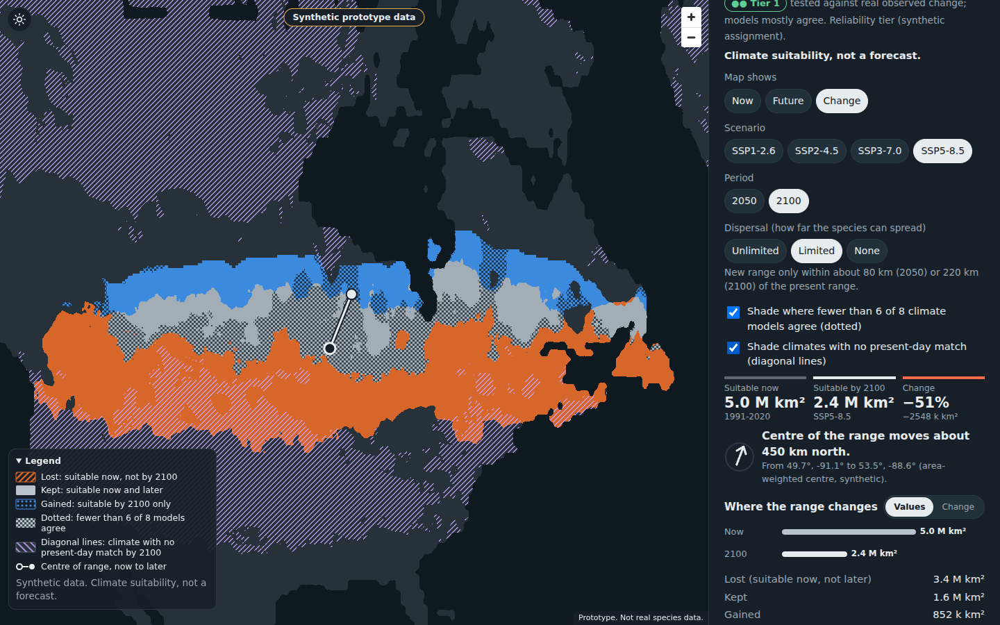
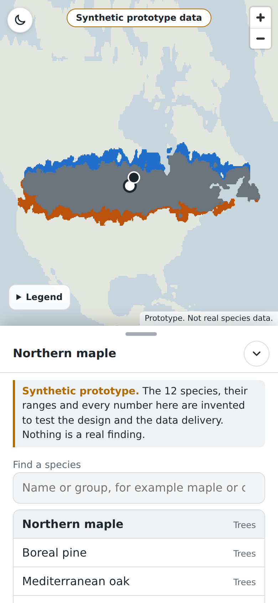
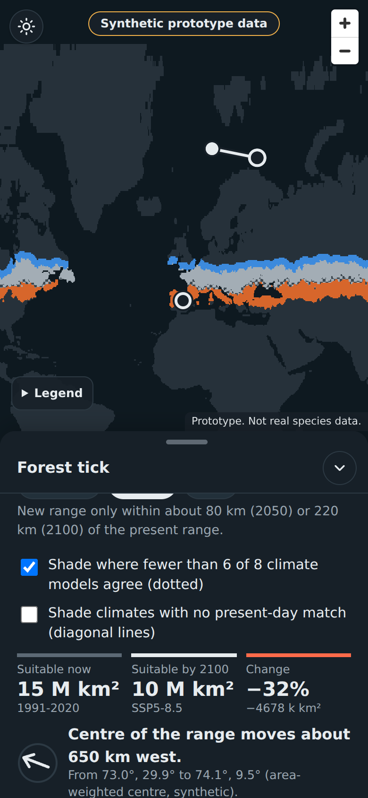
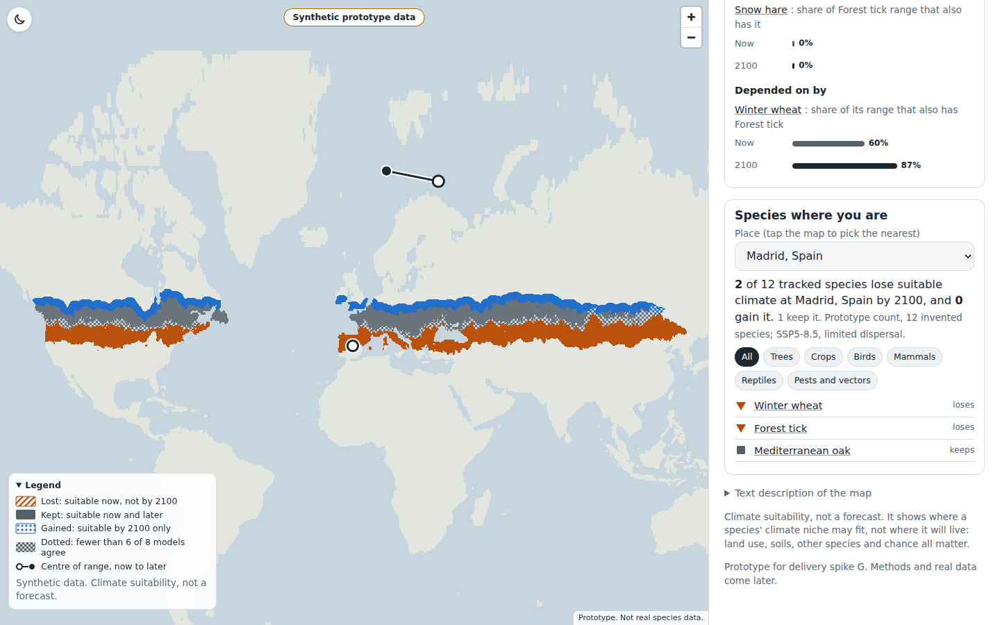
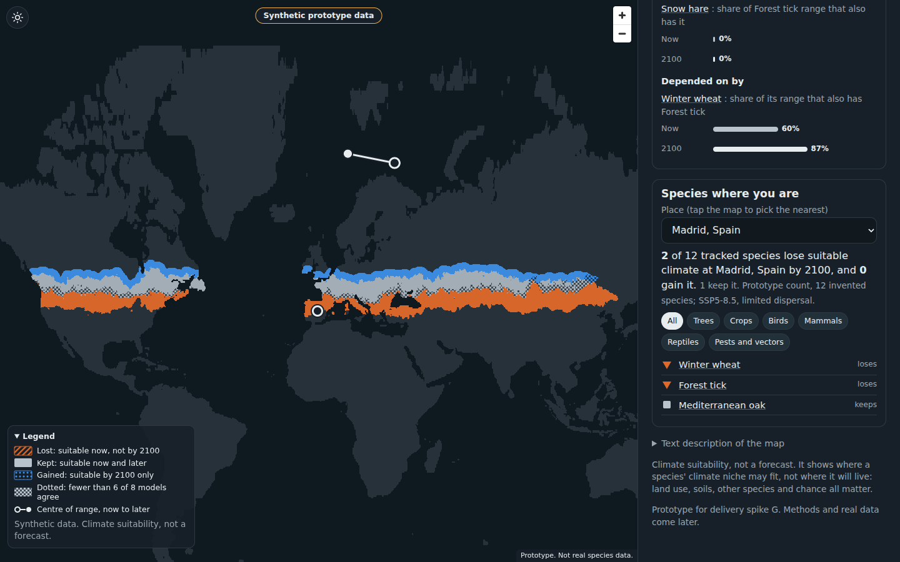

# Spike G: delivering species maps to the browser, and a prototype species page

Status: **complete for the spike (measurements, hosting plan, prototype, tests, screenshots).** Open decisions are in section 6.
Everything in `prototypes/species/` is **synthetic prototype data**: invented species, a made-up climate field over the site's
real 0.5 degree land mask upsampled to 1/24 degree (~4.6 km). Nothing here is ecology and nothing may be quoted as a result.

## 1. Delivery format: what was measured

Test raster: 8640 x 4320 (1/24 degree, ~4.6 km at the equator), land only (-60 to 83 N), 12 synthetic species of very different range size,
for now / ~2050 / ~2100 plus a model-agreement layer (8 members) and a per-scenario novel-climate layer.
Code: `prototypes/species/synth.py` (data), `encode.py` (writers), `bench/` (headless Chromium bench with its own HTTPS server).

Candidates (all lossless for the stored values):

| Format | What it is | Drawn with |
|---|---|---|
| PNG tiles | Web Mercator XYZ tiles, value in the pixel (suitability 7 bit + reach bit, agreement nibbles) | `createImageBitmap` -> WebGL texture |
| WebP tiles | Same tiles, lossless WebP | same |
| PMTiles | The PNG tiles in one PMTiles v3 archive, read by HTTP range | same, via `pmtiles.js` |
| COG | Cloud-Optimized GeoTIFF, EPSG:4326, 3 bands + overviews | `geotiff.js` -> WebGL texture |
| CTS (custom binary) | 256 x 256 blocks, planar bands, row-delta + raw deflate, 4 pooled levels, empty blocks cost 0 bytes; header + offset table in the style of `ctw/reshard.py`; inflated with `DecompressionStream('deflate-raw')` | typed array -> WebGL texture |

Colouring (lost / kept / gained, agreement, novelty, dispersal bound) is done in a fragment shader from the stored values, so switching period,
dispersal mode or overlay is a uniform change and **needs no refetch**. Switching **scenario** needs one more file (the scenario file), never the base file again.

### 1.1 Bytes per species (full 7 bit product, SSP2-4.5; mean of 12 synthetic species)

| Format | base (now) | per scenario (2050 + 2100 + agreement) | base + 1 scenario | base + 4 scenarios | 350 species |
|---|---|---|---|---|---|
| CTS | 391 KB | 831 KB | 1.22 MB | 3.7 MB | 1.30 GB |
| PNG tiles | 382 KB | 859 KB | 1.24 MB | 3.8 MB | 1.34 GB |
| PMTiles (PNG inside) | PNG + 0.1% | | 1.24 MB | 3.8 MB | 1.34 GB |
| WebP lossless tiles | 339 KB | 626 KB | 0.96 MB | 2.8 MB | 0.99 GB |
| COG (deflate) | 429 KB | 950 KB | 1.38 MB | 4.2 MB | 1.48 GB |

Spread across species (base + one scenario): 0.2 MB (small range) to 2.6 MB (huge range), median 0.8 MB. The roadmap's "1-3 MB per species per scenario" holds for the
full-value product and is conservative for the median. Compression, not format, decides size: all five are within about 40% of each other.
Caveat: 12 invented species with smooth, blob-shaped ranges; real SDM output is patchier, so real files will be larger than these. Treat as a lower bound until the pilot (Phase 3).

**Classified ("lite") product.** The page does not need 7 bit values. It needs suitable now (yes/no), 2050 and 2100 in 3 classes above the
threshold, the reach bit and the agreement counts. `encode.lite` builds that, as CTS; it is what the prototype ships (measured from `prototypes/species/data/`):

| | base | per scenario | base + 1 scenario | base + 4 scenarios | 350 species |
|---|---|---|---|---|---|
| lite CTS, mean of 12 | 49 KB | 177 KB | **226 KB** | **757 KB** | **~265 MB** |

Range of base + SSP2-4.5: 25 KB (small range) to 0.51 MB (widest). The lite product is about 5x smaller than the full product. The 7 bit values are only needed for a continuous
"how suitable" ramp; a threshold-and-class map answers the roadmap's questions (lost / kept / gained).
**Open decision for the owner:** do we want a continuous suitability ramp? If yes, budget the full product (about 1.3 GB, still small for R2).

### 1.2 Time to first draw and switching (headless Chromium, SwiftShader WebGL, species s01, SSP2-4.5, median of 3 runs)

Profiles: desktop = 1440 x 900, no throttling; mobile = 390 x 844 at dpr 3, 1.6 Mbit/s down, 150 ms RTT (CDP network emulation), CPU 4x slower.
"First draw" = request + decode + upload + draw of the whole-world view, base + scenario. "Scenario switch" = SSP2-4.5 -> SSP3-7.0 (one new file).
"Period switch" = 2050 -> 2100, no request. Server runs on localhost (so desktop numbers exclude real network latency).

| Format | desktop first draw | mobile first draw | desktop scenario switch | mobile scenario switch | period switch (desk / mob) | requests at first draw (desk / mob) | bytes at first draw (desk / mob) |
|---|---|---|---|---|---|---|---|
| CTS | **161 ms** | **1.09 s** | **63 ms** | **0.80 s** | 32 / 81 ms | 4 / 4 | 57 / 97 KB |
| WebP tiles | 306 ms | 1.48 s | 190 ms | 0.85 s | 32 / 74 ms | 6 / 10 | 17 / 44 KB |
| PNG tiles | 359 ms | 1.33 s | 124 ms | 0.84 s | 30 / 74 ms | 6 / 10 | 22 / 58 KB |
| PMTiles | 329 ms | 1.77 s | 110 ms | 1.24 s | 26 / 61 ms | 6 / 10 | 54 / 90 KB |
| COG | 458 ms | **5.17 s** | 156 ms | 3.88 s | 23 / 73 ms | 2 / 2 | 843 / 843 KB |

Readings:
- The period switch is a uniform change and costs one frame in every format. **No refetch in any format.** The scenario switch costs one file.
- Tile formats win on bytes for a world view (low-zoom tiles are tiny) but lose time to many small requests on a high-latency link (10 requests at 150 ms RTT), and
  PMTiles adds a serial directory lookup. COG as built here reads a large overview strip first (843 KB) and is worst on mobile.
- CTS wins on time because the world view is one pooled level (one read, one inflate); block granularity serves zoom-in; empty blocks are free (the "mostly empty ranges" case);
  and the dispersal reach bit rides in the same byte.
- Caveats: SwiftShader (software GL) makes upload+draw slower than a phone GPU; CDP CPU throttling is a rough proxy for a phone; only s01 was benchmarked end to end
  (bytes for all 12 species come from the encoder logs); the bench draws a world-view texture, not a zoomed MapLibre view with panning; 3 runs per cell, so differences under ~15% are noise.

### 1.3 Choice: CTS (custom binary), classified product, one base file + one file per scenario, per species

Why:
1. Fastest first draw on both profiles, fewest requests, best scenario switch. Same size as PNG in full form and about 5x smaller as the classified product.
2. No third-party reader code on the critical path (header, offset table, `DecompressionStream`); PMTiles and COG each need a vendor library.
3. Same family as the project's own `ctw/reshard.py` (header + offsets + planar arrays), so build tooling and test style carry over.
4. Pooled levels give a fast whole-world view and sharp detail when zoomed.

Why not the others: PNG/WebP tiles are the zero-custom-code fallback with the smallest first-draw bytes (what the roadmap suggested); they lose about 2x on desktop first draw and need 10 requests on mobile.
WebP is ~25% smaller than PNG, but its decode path in older Safari was not tested. PMTiles is attractive as one file per species but adds a directory round trip. COG is a GIS format; mobile first draw is too slow.
Risk of CTS: it is our own format. Mitigation: a short spec, a round-trip test in CI, and `format` and `version` fields in the header. **If the owner prefers no custom formats, PNG tiles are the safe second choice**; the page isolates loading behind one function.

### 1.4 Per-view download and storage (350 species x 4 scenarios)

Per view with the lite CTS: species index (~35 KB for 350 species, assumed from ~100 bytes a row) + base (median ~40 KB) + one scenario (median ~150 KB) = **about 0.2-0.4 MB**;
another scenario +0.1-0.3 MB; another period, dispersal mode or overlay +0. A session with 3 species and 2 scenarios each is about 1.5 MB. The full 7 bit product is about 5x that.
Storage: lite ~265 MB, full ~1.3 GB, plus 4 shared novel-climate layers (0.15-0.39 MB each, measured) and the land mask (0.2 MB).

## 2. Hosting plan

### 2.1 Verified vs assumed

Verified in this repository and sandbox:
- The site is one Cloudflare Worker with static assets from `./site` (`wrangler.jsonc`), deployed by `.github/workflows/deploy.yml` (`cloudflare/wrangler-action@v4`) on push to main (paths `site/**`, `web/**`, ...).
  `site/` is 27 MB in 75 files. The workflow has **no R2 step** and nothing for large data.
- The sandbox reaches only GCS/S3 and the GitHub API, so **no Cloudflare behaviour was tested** (no bucket, no CORS, no range test against R2).
- The bench's own HTTPS server (`bench/serve.js`) is local; it says nothing about R2 behaviour.

Assumed (Cloudflare documentation as recalled; confirm on the pricing and limits pages before building):
- R2 free tier: 10 GB-month storage, 1 M Class A and 10 M Class B operations per month, **no egress fee**. Above: ~$0.015/GB-month, $4.50 per M Class A, $0.36 per M Class B.
- R2 supports `Range`, ETag/conditional requests and per-bucket CORS rules. The `*.r2.dev` URL is rate limited and meant for development; production needs a **custom domain** (for example `data.climatetwins.org`), which also gives CDN caching and cache rules.
- Workers static-asset limits (25 MiB per file, about 20,000 files per version on the free plan) are fine for the site but a poor fit for ~1,400 growing species-scenario files; keep species data out of `site/`.

### 2.2 Layout and how the page finds files

```
https://data.climatetwins.org/species/v1/index.json           names, groups, bbox, tier, skill, per-file size and hash
https://data.climatetwins.org/species/v1/<id>/base.<hash>.cts
https://data.climatetwins.org/species/v1/<id>/<ssp>.<hash>.cts
https://data.climatetwins.org/species/v1/novel_<ssp>.<hash>.cts, land.<hash>.cts
```
- `index.json` is small, loaded at startup, `Cache-Control: public, max-age=300`. Every other file is **content-hashed and immutable** (`max-age=31536000, immutable`), so a rebuild can never serve a stale mix; the index carries the hashes.
- The page reads one base URL (a single constant, or `site/data/species-base.json` so a deploy can repoint it); locally it falls back to `./data/` as this prototype does.
- CORS on the bucket: `GET, HEAD` from `https://climatetwins.org`, `https://www.climatetwins.org`, the workers.dev address and `http://localhost:*`; allow `Range`; expose `Content-Length, ETag, Content-Range`.
- Files are a few hundred KB, so they are fetched whole; range reads only matter for block-level reads of the widest species when zoomed (optional).

### 2.3 Cost at ~100k views a month (derived from the assumed prices)

- Egress: 100k views x 0.4 MB first view, ~1.5 MB per session with switching -> **40-150 GB/month**; R2 egress is free.
- Reads: ~4-10 objects per view -> 0.4-1 M Class B per month, under the 10 M free; CDN caching removes most. Writes: ~1,500 objects per full publish, negligible.
- Storage: 0.27-1.3 GB, inside the 10 GB free tier. **Expected bill: $0.** At 10x traffic it stays in cents to a few dollars.

### 2.4 How the deploy workflow would publish

A separate workflow `species-publish.yml` (the site deploy stays fast and untouched), run by the roadmap's `species-publish` job:
1. Build `species/v<N>/` from the fit outputs (hashed files + `index.json`).
2. Upload to R2 with `rclone` (S3 API) or `wrangler r2 object put`, with `Content-Type` and `Cache-Control`; immutable files first, `index.json` last, so the page never sees an index pointing at missing files.
3. Keep the previous version 30 days, then delete.
4. Smoke test: fetch `index.json`, one species whole and by range, check `Access-Control-Allow-Origin` and a content hash.
Secrets: an R2 token scoped to the one bucket in the `production` environment, like the existing Cloudflare secrets. `deploy.yml` needs no change.

## 3. Prototype page

`prototypes/species/index.html`: one file, MapLibre from the same CDN as the site (offline test uses a local copy), data in `prototypes/species/data/` (12 invented species x base + 4 scenarios in the lite CTS format, 4 novelty layers, land mask, `stats.json`; 10.6 MB). Rebuild: `synth.py WORK`, `encode.py`, `build_site_data.py WORK prototypes/species/data`.
Open it with any static server in `prototypes/species/`. Visual language copied from `web/index.html` (fonts, ink/paper tokens, chips, Values / Change pill, bottom sheet on phones). **Every screen carries "Synthetic prototype data".**

What it has:
- **Species search** (combobox: type, arrow keys, Enter) plus a list; 12 invented species in 6 groups (Trees, Crops, Birds, Mammals, Reptiles, Pests and vectors).
- **Map shows** Now / Future / Change. Change uses lost = orange **diagonal hatching**, kept = grey, gained = blue **dots**; so no meaning rides on colour alone. Orange vs blue is colour-blind safe (both against grey); legend lives on the map (collapsed by default on phones so it does not hide the range) and the same words appear in the text description.
- **Scenario** (SSP1-2.6 .. SSP5-8.5) and **period** (2050 / 2100). Period, dispersal, view and overlays are shader uniforms (no fetch); scenario fetches one file.
- **Dispersal-bound** toggle: unlimited / limited (invented reach 80 km by 2050, 220 km by 2100, labelled as an assumption) / none; stats recompute from the same data.
- **Model agreement** shading (dotted where fewer than 6 of 8 members agree) and **novel-climate** shading (diagonal lines where the future climate has no present-day match), both off by default, both in the legend and in text.
- **Summary stats**: area now / future / change, range-centre shift in km and direction (arrow + words), lost / kept / gained areas, share of models agreeing. A text description of the map is in a disclosure and a live region.
- **Reliability tier badge**: "Tier 1" (tested against real observed change) or "Tier 2" (skill-checked only), with a text explanation; Tier 3 species are not shown (per the roadmap decision). The badge uses a symbol and words, not colour alone. Tier assignment here is synthetic (3 of 12 are Tier 1).
- The sentence **"Climate suitability, not a forecast."** under the species name, in the legend and in the footer.
- **Dependencies card** ("Depends on" / "Depended on by", links open the other species): now-vs-future overlap bars in the site's Values / Change style. Only ONE of the two views is in the DOM flow at a time (`.fig[data-view]` hides the other), switched only by the Values / Change toggle; tapping or focusing a row does nothing to the view (tested).
- **Place-centred list** ("Species where you are"): place select (or tap the map for the nearest of 24 places), "N of 12 tracked species lose / M gain", group chips, rows with an icon and the word loses / gains / keeps. Default place is Madrid so the list is not empty (several places have no species at all in the invented data).
- Light and dark (system, plus a button), keyboard operable (all controls are buttons, inputs or a combobox with visible focus rings), `prefers-reduced-motion` respected.

## 4. Tests and screenshots

`tests/test_species_prototype.py` (Playwright, offline: `PW_CHROMIUM` and `PW_MAPLIBRE_DIR`), run at 1440 x 900 and 390 x 844 (dpr 2, touch), light and dark: 4 runs, **all pass**. For each it checks:
no JS error, the map actually shows range colours (screenshot pixel count, since a WebGL canvas cannot be read back), no horizontal overflow before and after interaction, no unnamed control, searching "tick" and "maple" selects the species, scenario / period / dispersal / overlay clicks work, the Tier badge and "not a forecast" and "synthetic" text are present, a Tier 1 species shows Tier 1, **each figure (summary and dependencies) shows exactly one of Values or Change, clicking a row never changes it, and the toggle works**, mobile sheet expand / collapse, Tab order starts with buttons.

Screenshots (`docs/spikes/img/`; all synthetic data):

| | |
|---|---|
|  desktop light, change view |  desktop dark, SSP5-8.5 2100, limited dispersal, agreement and novelty on |
|  mobile light, legend collapsed |  mobile dark, sheet expanded |
|  dependencies and place list |  same, dark |

Fixed in this pass: the test's blank-canvas check always read 0 (WebGL without a preserved buffer) so it never ran; replaced by a screenshot check. The reliability badge was High/Moderate/Low, now Tier 1 / Tier 2 as required; place list default was an empty place; legend covered the range on phones (now collapsed there); Values-bar labels were clipped at the panel edge (bar lengths shortened).

## 5. Decisions made in this spike

1. Deliver species as **CTS binary, lite classified product**, base + per-scenario files, per species, fetched whole, coloured in a shader. (Section 1.3.)
2. Host on **R2 behind a custom domain**, content-hashed immutable files, small `index.json` as the only mutable file; separate publish workflow. (Section 2.)
3. The page needs no refetch for period, dispersal, view or overlays; one file for a scenario change.
4. The figure toggle pattern (one view at a time) applies to every Values / Change figure on the species page.
5. A model-agreement and novelty shading are overlays with legend entries, not separate maps.

## 6. Open questions and what could not be verified

Owner decisions:
- Continuous suitability ramp or three classes? (about 5x the bytes: 1.3 GB vs 265 MB for 350 species, still cheap to host.)
- Is a custom binary format acceptable, or should it be PNG tiles (safe fallback, measured slightly slower)?
- Custom domain for data (`data.climatetwins.org`) and an R2 token for the publish workflow.
- Wording of the tier badge, and whether Tier 2 species get the map at full prominence.

Not verified (be careful quoting any of the above):
- **Everything is synthetic.** Real SDM output has patchier ranges, so real file sizes will be larger than measured here; re-run the bench on the Phase 3 pilot.
- **No Cloudflare behaviour was tested** (R2 CORS, ranges, caching, custom domain, prices and limits are from documentation as recalled).
- Delivery timings are headless Chromium with software WebGL and CDP throttling, on localhost, one species benchmarked end to end, 3 runs; no real phone, no real network, no Safari or Firefox.
- The bench draws a whole-world texture; zoomed panning with block-level reads is implemented in the prototype but its cost was not benchmarked.
- Screen reader behaviour (VoiceOver, NVDA) was not tested; only roles, names, focus order and live-region text were checked by script. Colour contrast was checked by eye and by the `dataviz` palette rules, not with an automated audit of the page.
- Colour-blind simulation was not run on the screenshots; the safety argument is hatching/dots plus hue pair, not a measured simulation.
- The test cannot catch a wrong pixel; only a human looking at the screenshots does.
